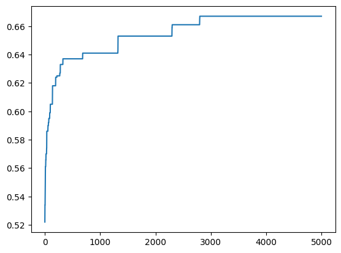

# Introduction

The laboratory has been developed in collaboration with @giovanni-violo.

The goal of this laboratory is to implement a genetic algorithm to maximize the fitness of individuals based on a provided function. Detailed information about the implementation can be found in the [Jupiter Project](lab9.ipynb).

## Results

The following tables are divided per

- PC: _Problem Class_, i.e. the parameter of the `make_problem` function
- PS _Parameter Set_ i.e. the set of parameter of the algorithm.

## PS-1 

### PC-10

Parameter set:

- POPULATION_SIZE = 4
- OFFSPRING_SIZE = 6
- GENETIC_OPS_PROB_SELECTION = 0.5
- RECOMBINATION_SLICE_SIZE = 500
- MUTATION_SLICE_SIZE = 100

| Iteration | Fitness Calls | Best Individual | Generations |
| --------- | ------------- | --------------- | ----------- |
| 1         | 30004         | 0.26            | 5000        |
| 2         | 30004         | 0.27            | 5000        |
| 3         | 30004         | 0.29            | 5000        |
| 4         | 5674          | 0.30            | 945         |
| 5         | 9430          | 0.31            | 1571        |

Setting the Fitness Threshold to 1:

| Iteration | Fitness Calls | Best Individual | Generations |
| --------- | ------------- | --------------- | ----------- |
| 1         | 30004         | 0.35            | 5000        |
| 2         | 30004         | 0.28            | 5000        |
| 3         | 30004         | 0.27            | 5000        |
| 4         | 30004         | 0.31            | 5000        |
| 5         | 30004         | 0.29            | 5000        |

We can see that the algorithm cannot pass the threshold of 0.35 within the 5000 generations limit. If we try and double the number of generations:

| Iteration | Fitness Calls | Best Individual | Generations |
| --------- | ------------- | --------------- | ----------- |
| 1         | 60004         | 0.34            | 10000       |
| 2         | 60004         | 0.33            | 10000       |
| 3         | 60004         | 0.31            | 10000       |
| 4         | 60004         | 0.32            | 10000       |
| 5         | 60004         | 0.28            | 10000       |

Still no luck.

Let's try with other Problem Classes.

### PC-1

We came back to 5000 max generations.

| Iteration | Fitness Calls | Best Individual | Generations |
| --------- | ------------- | --------------- | ----------- |
| 1         | 30004         | 0.66            | 5000       |
| 2         | 30004         | 0.65            | 5000       |
| 3         | 30004         | 0.66            | 5000       |
| 4         | 30004         | 0.67            | 5000       |
| 5         | 30004         | 0.67            | 5000       |

We can see the results are better.

### PC-2

| Iteration | Fitness Calls | Best Individual | Generations |
| --------- | ------------- | --------------- | ----------- |
| 1         | 30004         | 0.61            | 5000       |
| 2         | 30004         | 0.34            | 5000       |
| 3         | 30004         | 0.33            | 5000       |
| 4         | 30004         | 0.34            | 5000       |
| 5         | 30004         | 0.62            | 5000       |

In this case the variation is really high.

### PC-3

| Iteration | Fitness Calls | Best Individual | Generations |
| --------- | ------------- | --------------- | ----------- |
| 1         | 30004         | 0.54            | 5000       |
| 2         | 30004         | 0.24            | 5000       |
| 3         | 30004         | 0.41            | 5000       |
| 4         | 30004         | 0.54            | 5000       |
| 5         | 30004         | 0.40            | 5000       |

### PC-5

| Iteration | Fitness Calls | Best Individual | Generations |
| --------- | ------------- | --------------- | ----------- |
| 1         | 30004         | 0.42            | 5000       |
| 2         | 30004         | 0.40            | 5000       |
| 3         | 30004         | 0.15            | 5000       |
| 4         | 30004         | 0.43            | 5000       |
| 5         | 30004         | 0.42            | 5000       |

### Conclusions

The randomness of the algorithm makes it hard to predict the results.

## Plots

To better understand the algorithm we decided to plot the fitness of the best individual and the average fitness of the population at each generation.

These are the results with the same parameters as above for the different PCs.

### PC-1
Best Individual in generations:

Average fitness in generations:

We noticed that the best remain constant for many generations and then suddenly changes. This is probably due to the fact that the algorithm is stuck in a local maximum and then it finds a better one.

### PC-2
Best Individual in generations:

Average fitness in generations:

Here the variation of the average is much more pronounced than in the previous case. 

### PC-5
Best Individual in generations:

Average fitness in generations:

Here the algorithm finds a good solution in the first generations and then it gets stuck in a local maximum, so the average fitness remains really low.

### PC-10

Best Individual in generations:

Average fitness in generations:

Here the algorithm needs a lot of time to find a good solution, and it is not great. The average fitness is too noisy to determine something.