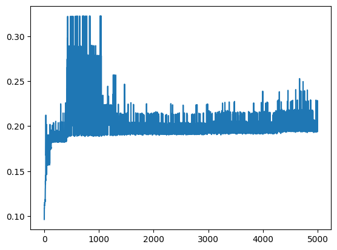

# Introduction

The laboratory has been developed in collaboration with @giovanni-violo.

The goal of this laboratory is to implement a genetic algorithm to maximize the fitness of individuals based on a provided function. Detailed information about the implementation can be found in the [Jupiter Project](lab9.ipynb).

## Results

The following tables are divided per

- PC: _Problem Class_, i.e. the parameter of the `make_problem` function
- PS _Parameter Set_ i.e. the set of parameter of the algorithm.

### Final results

- PC-10: 0.30 fitness, 945 calls 
- PC-5: 0.42 fitness, 6004 calls
- PC-2: 0.52 fitness, 6004 calls
- PC-1: 0.60 fitness, 778 calls

## First iterations

### PC-10

Parameter set:

```
- POPULATION_SIZE = 4
- OFFSPRING_SIZE = 6
- GENETIC_OPS_PROB_SELECTION = 0.5
- RECOMBINATION_SLICE_SIZE = 500
- MUTATION_SLICE_SIZE = 100
```

| Iteration | Fitness Calls | Best Individual | Generations |
| --------- | ------------- | --------------- | ----------- |
| 1         | 30004         | 0.26            | 5000        |
| 2         | 30004         | 0.27            | 5000        |
| 3         | 30004         | 0.29            | 5000        |
| 4         | 5674          | 0.30            | 945         |
| 5         | 9430          | 0.31            | 1571        |

We can see that the algorithm cannot pass the threshold of 0.35 within the 5000 generations limit. If we try and double the number of generations and set the Fitness Threshold to 1:

| Iteration | Fitness Calls | Best Individual | Generations |
| --------- | ------------- | --------------- | ----------- |
| 1         | 60004         | 0.34            | 10000       |
| 2         | 60004         | 0.33            | 10000       |
| 3         | 60004         | 0.31            | 10000       |
| 4         | 60004         | 0.32            | 10000       |
| 5         | 60004         | 0.28            | 10000       |

Still no luck.

Let's try with other Problem Classes.

### PC-1

We came back to 5000 max generations.

| Iteration | Fitness Calls | Best Individual | Generations |
| --------- | ------------- | --------------- | ----------- |
| 1         | 30004         | 0.66            | 5000       |
| 2         | 30004         | 0.65            | 5000       |
| 3         | 30004         | 0.66            | 5000       |
| 4         | 30004         | 0.67            | 5000       |
| 5         | 30004         | 0.67            | 5000       |

We can see the results are better.

### PC-2

| Iteration | Fitness Calls | Best Individual | Generations |
| --------- | ------------- | --------------- | ----------- |
| 1         | 30004         | 0.61            | 5000       |
| 2         | 30004         | 0.34            | 5000       |
| 3         | 30004         | 0.33            | 5000       |
| 4         | 30004         | 0.34            | 5000       |
| 5         | 30004         | 0.62            | 5000       |

In this case the variation is really high.

### PC-3

| Iteration | Fitness Calls | Best Individual | Generations |
| --------- | ------------- | --------------- | ----------- |
| 1         | 30004         | 0.54            | 5000       |
| 2         | 30004         | 0.24            | 5000       |
| 3         | 30004         | 0.41            | 5000       |
| 4         | 30004         | 0.54            | 5000       |
| 5         | 30004         | 0.40            | 5000       |

### PC-5

| Iteration | Fitness Calls | Best Individual | Generations |
| --------- | ------------- | --------------- | ----------- |
| 1         | 30004         | 0.42            | 5000       |
| 2         | 30004         | 0.40            | 5000       |
| 3         | 30004         | 0.15            | 5000       |
| 4         | 30004         | 0.43            | 5000       |
| 5         | 30004         | 0.42            | 5000       |

### Conclusions

The randomness of the algorithm makes it hard to predict the results.

## Plots

To better understand the algorithm we decided to plot the fitness of the best individual and the average fitness of the population at each generation.

These are the results with the same parameters as above for the different PCs.

### PC-1
Best Individual in generations:


Average fitness in generations:


We noticed that the best remain constant for many generations and then suddenly changes. This is probably due to the fact that the algorithm is stuck in a local maximum and then it finds a better one.

### PC-2
Best Individual in generations:


Average fitness in generations:


Here the variation of the average is much more pronounced than in the previous case. 

### PC-5
Best Individual in generations:


Average fitness in generations:



Here the algorithm finds a good solution in the first generations and then it gets stuck in a local maximum, so the average fitness remains really low.

### PC-10

Best Individual in generations:


Average fitness in generations:


Here the algorithm needs a lot of time to find a good solution, and it is not great. The average fitness is too noisy to determine something.

## Recombination vs Mutation

To evaluate our recombination and mutation strategies we tried and analized what happened using heavily one or the other method working with the ```GENETIC_OPS_PROB_SELECTION``` parameter.

To make the document smaller we will only evaluate PC 2 and 10.

### Mutate and Impera

```GENETIC_OPS_PROB_SELECTION = 0.01```

#### PC-10
```
Best individual fitness: 32.44%
Generations: 5000
Total fitness calls: 30004
```
Best Individual in generations:


Average fitness in generations:


#### PC-2

```
Best individual fitness: 30.29%
Generations: 5000
Total fitness calls: 30004
```

Best Individual in generations:


Average fitness in generations:


#### Conclusions

The average spikes much more than before and the results does not get better in both cases. We ran many instances and found similar results taking the most representative plots.

### Recombine without care

```GENETIC_OPS_PROB_SELECTION = 0.99```

#### PC-10

```
Best individual fitness: 33.58%
Generations: 5000
Total fitness calls: 30004
```
Best Individual in generations:


Average fitness in generations:


#### PC-2

```
Best individual fitness: 34.00%
Generations: 5000
Total fitness calls: 30004
```

Best Individual in generations:


Average fitness in generations:


#### Conclusions

Similar conclusions to the mainly mutation one. 

### Results

We can see that the use of recombination vs mutation in our case does not influence heavilty the results.

## Parent Selection

We want to see how generating new offsprings by the best parents in the population affects the fitness.

```
GENETIC_OPS_PROB_SELECTION = 0.5
PARENT_BEST_PROBABILITY = 0
```

### PC-10

```
Best individual fitness: 27.43%
Generations: 5000
Total fitness calls: 30004
```

Best Individual in generations:


Average fitness in generations:


### PC-2

```
Best individual fitness: 33.86%
Generations: 5000
Total fitness calls: 30004
```

Best Individual in generations:


Average fitness in generations:


### Conclusions

Unfortunately neither this parameter has really a big influence on the fitness quality

## Final conclusions


Given our final results and our inability to improve them acting on various parameters, we can conclude that the main problem is an eccessive randomness in our solution. This was a conscious decision in the beginning of the development because the problem was too abstract for us to find a clever and ad-hoc solution, so we prefered to use a stochastic method. 